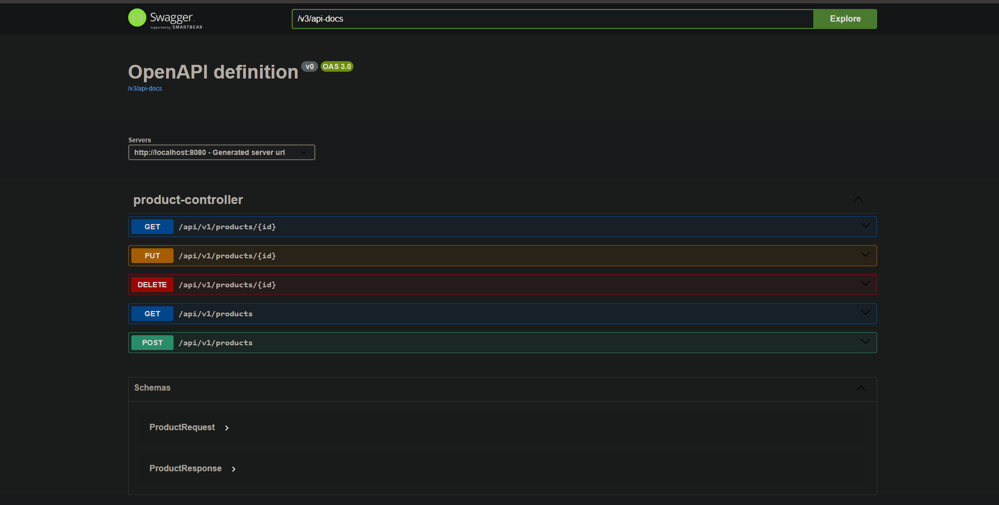
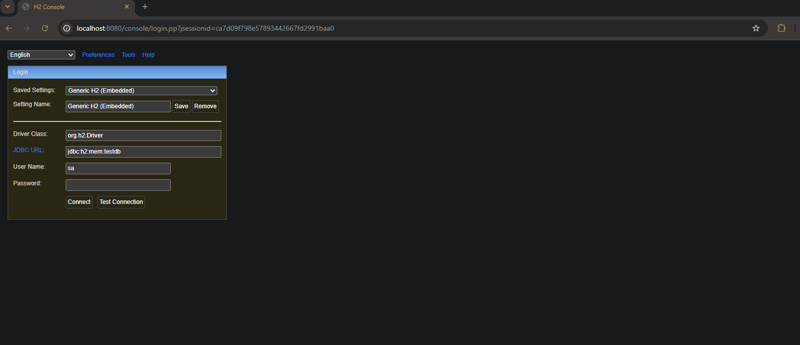
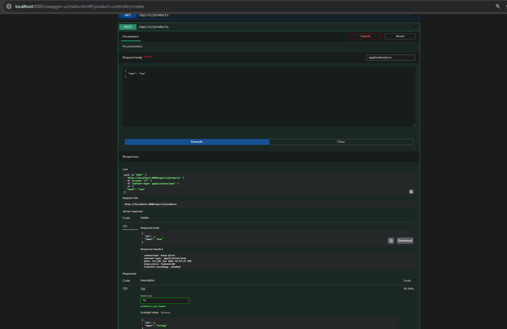
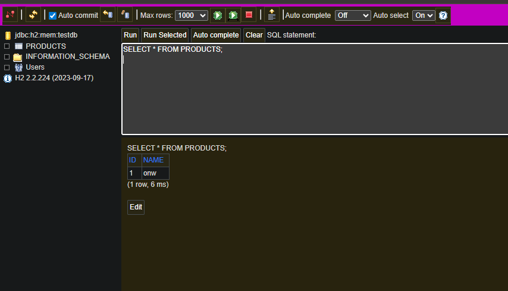
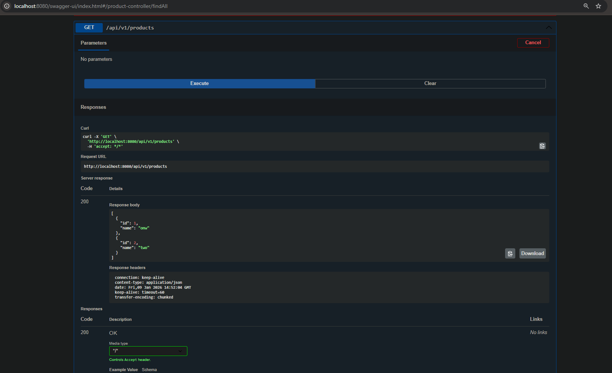
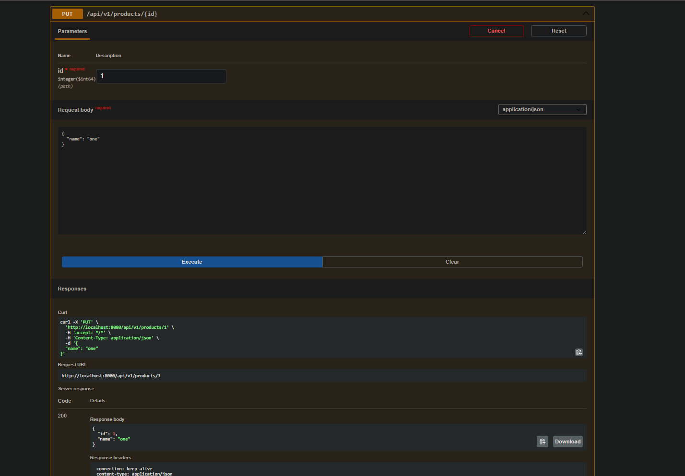
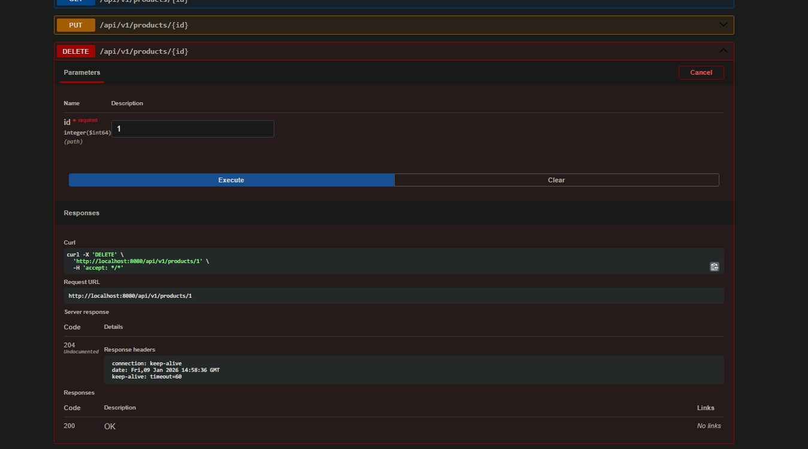
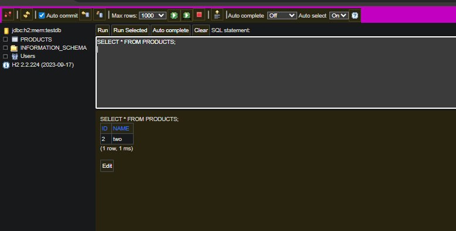
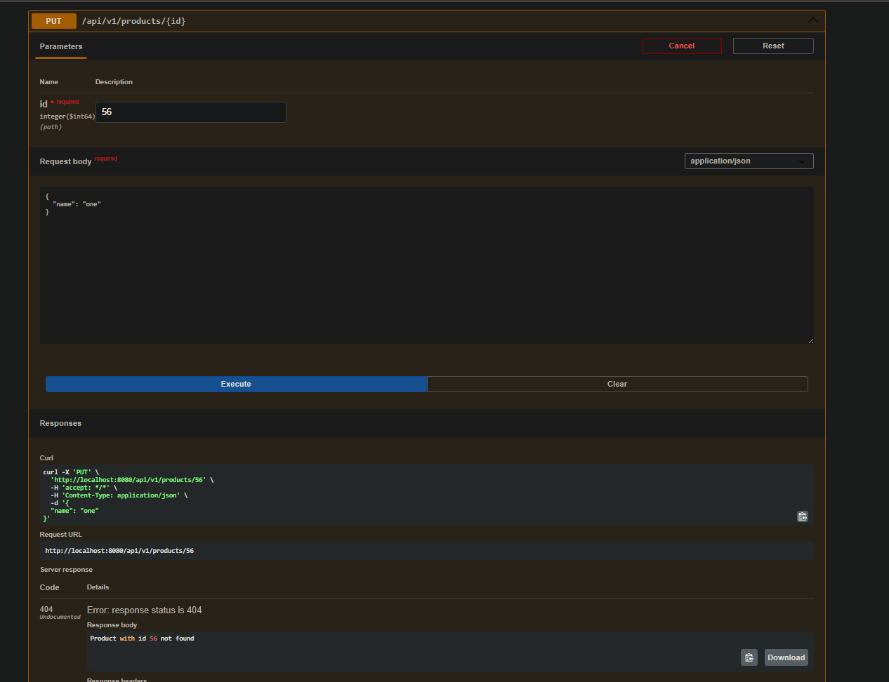

# First REST API Spring Boot Application

## Description
This project is a backend REST API created using Java and Spring Boot.
The application allows users to manage a simple product catalogue by performing basic CRUD operations, create, read, update, and delete products.

For data storage, the project uses an H2 in-memory database, which means the data is stored only while the application is running. This makes it very useful for development, testing, and learning purposes, without the need to configure an external database.

The project also includes Swagger UI, which is used to document and test the API endpoints. Using Swagger, all HTTP methods can be tested directly from the browser in a clear and easy way
---

## 🛠 Technologies Used
- Java 21
- Spring Boot
- Spring Web
- Spring Data JPA
- H2 Database
- Swagger (OpenAPI)
- Maven

---

##  How to Run the Application

1.  Clone this repository.
2.  Open the project in IntelliJ IDEA.
3.  Run the `FirstRestApiSpringApplication.java` class.
4.  The server will start on `http://localhost:8080`.

## API Documentation (Swagger UI)
The application includes Swagger UI to visualize and interact with the API endpoints.
* **URL:** `http://localhost:8080/swagger-ui/index.html`

*(Screenshot showing the list of all endpoints in the browser)*



## Database (H2 Console)
The application uses an H2 in-memory database.
* **URL:** `http://localhost:8080/console`
* **JDBC URL:** `jdbc:h2:mem:testdb`
* **Username:** `sa`
* **Password:** *(Empty)*

console login page
 

## Endpoints & Use Cases

### 1. Create a Product (POST)
Creates a new product in the database.
* **URL:** `/api/v1/products`
* **Body:**
    ```json
    {
      "name": "insert1"
    }


* **Database reflecting insertation** 



### 2. Get All Products (GET)
Retrieves a list of all available products.
* **URL:** `/api/v1/products`
* **Response Status:** `200 OK`



### 3. Get Product by ID (GET)
Retrieves a specific product by its unique ID.
* **URL:** `/api/v1/products/{id}`
* **Example:** `/api/v1/products/1`
* **Response Status:** `200 OK` 


### 4. Update Product (PUT)
Updates the name of an existing product.
* **URL:** `/api/v1/products/{id}`
* **Body:**
    ```json
    {
      "name": "Updated Name"
    }
    ```
* **Response Status:** `200 OK`



* **Database reflection:**


### 5. Delete Product (DELETE)
Removes a product from the database.
* **URL:** `/api/v1/products/{id}`
* **Response Status:** `204 No Content`



* **Database reflection:**



## Error Handling
The application handles errors gracefully. If a user requests an ID that doesn't exist, the API returns a friendly 404 JSON response instead of a 500 Server Error.


**Product not found on put**


